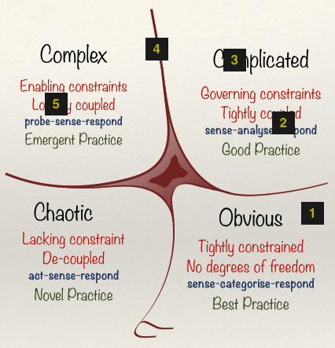

## Agile Engineering
### __Over__
## *"Over Engineering"*

^ Forgive the title. I'm going to present some forming thoughts from experiences with our internal teams but also customers teams. Observations where in the name of Agile technical teams can find them selves overly focused on the engineering challenge.

^ Building agile engineering teams that make mature, smart decisions for complex problems is a fairly common goal. If it were easy, Amazon would be selling far fewer books on the subject.

^ When people approach problems they bring with them certain biases to how they view that problem domain. Engineers tend to see every problem as complex. After all complex problems are what we're specially skilled to solve. However, is every element in an engineering project complex?

^ How can a framework from cognitive science (Cynefin) help teams mature in their thinking and approach to problem solving? Identifying strategies or options to break down complex problems and produce clean, simple solutions can make agile teams much more effective.

^ Although it may sound like common sense, using an explicit process can help expose this bias and identify the path to a solution.

^ You will leave this session able to apply the Cynefin framework to technical analysis and have a set of questions you can pose to teams in order for them to build mature options when approaching problems and avoid committing too early to the wrong path.

---

## Alistair Stead
###_Chief Technology Office_
#### _@alistairstead_

### www.inviqa.com

^ I'm CTO with Inviqa a system integrator that provides technical services and consultancy to enterprise clients. We have undergone our own Agile transformation during our growth from 20 people to over 200 people. We have at any given time 10-15 Agile teams each working on isolate programmes of work for individual clients. This impacts how we apply Agile principles but I hope there is some useful learning for the room.

---

### Building mature Agile organisations & teams is a common goal

^ Empowering teams and allowing them to make decisions about how best to solve a problem and choose the best path for the product or project requires a great deal of trust. Organisations or managers who are transitioning towards a more Agile approach can often be nervous about this.

^ I have been asked many time by stakeholders or disconnected observers how can you build a team that can make smart and mature decisions how best to solve a problem, balancing budget control, time constraints, business needs and a myriad of other factors.

---

## A small selection of reading materials...

^ Close to 1,000 unique titles on the subject of applying Agile principles. There are many perspectives and it is clear that no single formula can be applied.

---

### This appears to be a really complex problem.

^ The context in which you approach this problem is unique to your own organisation and to the problem domain you operate so everything you read must be interpreted and transposed to your own needs. Successful adoption and application requires experience and I believe this is the root of any stakeholder or observer concerns.

---

### Not that long ago software delivery _appeared broken..._

^ Before February 2001 software delivery had a broad array of methodologies from heavily regulated command and control systems to lighter development methods.

^ The common theme seemed to be customer dissatisfaction

---

### Is it any better now?

^ On this data the creation of the Agile manifest triggered an industry wide shift.

^ Agile and supporting lightweight methodologies such as SCRUM are now almost defacto.

^ However it seems some people get it and it has changed the project outcomes. Some however are just doing what they always did but dressing it up in vague terminology

----

### 12 guiding principles

^ The Agile Manifesto is founded on 12 principles and these we see interpreted in agile delivery teams

---

"Our highest priority is to satisfy the customer
through early and continuous delivery
of valuable software."

^ Prioritise early delivery of value

---

"Welcome changing requirements, even late in
development. Agile processes harness change for
the customer's competitive advantage."

^ Welcome change and harness it for competitive advantage

---

"Deliver working software frequently, from a
couple of weeks to a couple of months, with a
preference to the shorter timescale."

^ Frequent delivery

---

"Business people and developers must work
together daily throughout the project."

^ Collaboration between developers and business

---

"Build projects around motivated individuals.
Give them the environment and support they need,
and trust them to get the job done."

^ Empower a motivated team to get the job done

---

"The most efficient and effective method of
conveying information to and within a development
team is face-to-face conversation."

^ Prioritise colocation of the team

---

"Working software is the primary measure of progress."

^ Measure progress with working software

---

"Agile processes promote sustainable development.
The sponsors, developers, and users should be able
to maintain a constant pace indefinitely."

^ Sustainable pace

---

"Continuous attention to __technical excellence__
and good design enhances agility."

^ Technical excellence

---

"Simplicity __the art of maximizing the amount
of work not done__ is essential."

^ Simplification

---

"The __best architectures__, requirements, and __designs
emerge__ from self-organizing teams."

^ Emergent design

---

"At regular intervals, the team reflects on how
to become more effective, then tunes and adjusts
its behavior accordingly."

^ Reflect and adjust

---

### Application of these 12 principles
### __What is the appropriate mix?__

^ All the books and methodologies provide insight and guidance about how to apply these principles but one of the key aspects that often does not leap out of any text or process is how to balance these principles within any given context.

^ If you focus on one to the detriment of all others then there is obviously an issue, but just what is the right mix or weighting to these principles and is that static?

---

## __Personal bias__
### Is the team aware of imbalance?

^ I find the engineers will have a bias towards the exercise of solving the problem in the most elegant way. This is something that changes as the experience grows. I often describe this as "maturity" but I'm not sure that is the case. Are there external influences that make this the case?

^ The personal bias based on experience and role within an Agile team can be a very useful tool if it is explicit and understood. However if it is hidden and ignored then some principles can be under represented within the make up of the team.

^ The scrum coach or scrum master may be an appropriate balancing force, but again only if they are aware of the imbalance.

---

#### _Individuals and interactions over_
## processes and tools
### __supporting the 12 principles__

^ The processes and tools commonly found in projects that support the 12 principles are not evenly distributed and seem to reflect a bias of some kind. They are built by technical people so they favour their interests.

---

## Process

Iterations / Sprints, Example workshops, Daily scrum / standup, Sprint demo / Show & tell, Retrospective

^ The processes you find in an Agile project are all focused on optimising communication, improvements and feedback and to some extent impact all of the principles.

^ The processes are adopted and used by all members of the team even if prioritised differently.

---

## Tools & Practices

Continuous integration, Automated unit testing, Test-driven development, Design patterns, Domain-driven design, Code refactoring, Static code analysis, Continuous deployment, Behaviour Driven Development

^ The tools commonly adopted to facilitate Agile delivery are almost singularly focused on defining and maintaining quality and by association sustainability.

^ The tools are primarily adopted and used by the technical members of the team. Even if they are information radiators, they are still of acute interest to the technical members.

---

### Dialling quality to the max...
### __Is this "_Over Engineering_"?__

^ The bias of the tool towards technical quality has the possible result of focusing the technical team members on a very narrow metric that may not be inappropriate in all scenarios

---

## What is __Quality__?
#### Semiotics is a powerful field and "Quality" is a highly charged term.

^ I can personally attest this based on the first time I gave this talk and triggered a lengthy debate with many of the audience.

---

## Inner Quality

* Clean code
* Loose coupling
* High cohesion
* Coding Standards
* Testable

---

## Outer Quality

* Functionally correct
* Stable
* Highly performant
* Cost effective
* Valuable
* Maintainable

^ There is no order or implication of importance in this list

---

### Turning the quality dial is dangerous...
### No one wants a __big ball of mud__

^ Inner quality to ensure that a project is sustainable and maintainable. The the final solution can emerge as detail is discovered without it being blocked by poor decisions and solutions.

---

### So perhaps when we say "__Quality__",
### we should say "__Sustainability__"?

---

### Dialling sustainability to the max...
### __Is this "_Over Engineering_"?__

^ Well this supposes we know how our code will evolve and what the future needs will be.
^ Or do we know where to add abstraction to facilitate flexibility in the future

---

### How do you make mature decisions regarding appropriate investment in sustainability?

^ How do you help teams of all experience levels make effective mature decisions that allow them to deliver successfully
^ We will circle back to this later

---

### Symptoms to look for:

^ What will you likely see as symptoms to suggest there is some form of over-engineering happening?

---

## **Cost of change**
### Not due to inflexibility but **complexity**

^ Accidental complexity due to a legacy of applied decisions such as tooling, abstraction and architecture to solve problems that don't yet exist

^ Complexity related to perceived technical debt and attempting to change too much too quickly.

---

### **Long** lead time within the iteration

^ Very little visibility of implementation within the team until it is complete

---

### Inability to innovate / iterate a requirement

^ The team possibly committed to a solution during planning and now that have to burn the hours to complete it.

---

### Simplicity or simplification is elusive

^ The team see all the requirements as complex and can't chunk them down

---

### What are root causes?

^ Speculatively I believe there are some identifiable factors.

---

### Interview questioning for engineers
#### Do we perpetuate the issues through selection?

^ We optimise for inner quality. During interviews we ask about all the things that yield technical quality and sustainability. What about simplification and designing iterative delivery of features?

---

### Training for engineers
#### Focus on complex problems & inner quality of the solutions

^ Most technical training focuses on inner quality, architecture, patterns, and clean code. This is important but must be balanced in the context of the project.

---

### Tools to help the **team**

---

## **80%** of the work is knowing your next move

^ I think some people can become quite overwhelmed by staying in the problem and trying to identify the BEST solution before breaking ground.

^ Experimenting with at least one possible solution is the thing that overcomes that feeling

---

### Experimenting will facilitate learning
#### **A solution even a bad one shows you a next move**

---

### With a pre-disposition for complexity
#### **Simplification is not obvious**
#### **Designing effective experiments can be elusive**

---

## Cynefin [^1]
### A Leaders Framework for Decision Making

[^1]: David J. Snowden and Mary E. Boone

^ The Cynefin framework was developed by Dave Snowden and some of his colleagues to describe different types of problems.

^ It is a sense making framework, developed for leaders in complex and stressful situations where their first conclusion or "gut" feel may not be the most appropriate action. It supports decision making in situations of uncertainty.

^ The framework provides contexts that guide what sort of explanations or solutions might apply. It draws on research into complex adaptive systems theory, cognitive science, anthropology, and narrative patterns, as well as evolutionary psychology, to describe problems, situations, and systems. It "explores the relationship between man, experience, and context"[4] and proposes new approaches to communication, decision-making, policy-making, and knowledge management in complex social environments.

---

^ The framework introduces four domains – obvious, complicated, complex and chaotic – and a fifth domain in the centre, disorder, for when it’s unclear which type of problem we’re dealing with.

^ We all have a preferred domain whose practices we fall back into. Engineers tend to see every problem as complex, other stakeholders may often see problems as obvious.

^ There’s also a little fold beneath the “obvious” to “chaotic” boundary, to show how easily obvious solutions can cause complacency and tip into chaos.

---

## Have we (the team) ever done this before? [^2]

1. Entire team
1. Someone in the team
1. Someone in the organisation
1. Someone in the world
1. Nobody ever

[^2]: Liz Keogh - conversation at park bench BDD Exchange 2014

---

^ What domain are you working in and is there a ready made solution.
^ Is this problem the key to the business? Is this the unique selling point?
^ Commodity or differentiator
^ Decide when good is good enough…
^ Algorithm performance Vs heuristics
^ Pixel perfection Vs facsimile

---

## Complex

R&D, No common practices, Unproven market, No scope, **Invest in creating options**, Set budgets, limit time, sustainability is unimportant short term until you transition to Complicated domain.

**LEARNING is your competitive advantage**

---

^ Sustainability is less important till the problem or solution are proven. Moved to the complicated domain.
^ This is what spikes are for.

## Complicated

Agile (Scrum/Kanban), **Follow good practice**, Proven market to be exploited or disrupted, Flexible scope, Maintain options, Set budgets, sustainability is important long term

**You are EARNING a competitive advantage**

^ Sustainability is important as you need to have options as requirements and priorities shift

---

## Obvious

Agile or Waterfall? **Follow known best practices**, Fixed scope, Committing to a selected option, Set budget, sustainability & quality should be high with minimal investment due to low complexity

**You are using efficiency and commodity to sustain your advantage**

---

## Finding the path
### How do you make mature decisions regarding appropriate sustainability?

^ Circling back, we can now use these questions and the domain to decide on the next step for strategy and quality approach

---

## [fit] When being __excellent__ is __bad__

^ Deciding to not invest in analysis, planning and design of commodities
^ Don’t invest too much in standard features. Don’t validate standard behaviour rather focus on other more important unique features.
^ When a clients USP is their product or price they don’t get value from an amazing shopping experience or technical elegance. They get value from going to market early and capitalising on that advantage.
^ If it brings value later then you can improve the other factors.

---

## [fit] When being __good is not enough__

^ Making sure that commodities are not the only set of project deliverables.
^ Focus on the clients USP and invest in that.

---

## This is obvious
#### But the explicit act can break bias and help shape mature decisions

^ These suggestions and observations may appear obvious, but in order to break any bias from experienced teams or to support less experienced teams to make the most mature decisions then making the act explicit and defining the path to a decision can be very helpful.

---

### Renewed focus on **simplification**
#### Ephemeralization of the industry

^ The ability to build the solution is no always the competitive advantage.
^ Building the best possible simple commodity feature is not always the most advantageous way to invest effort and budget

^ Build Vs Buy
^ Invest Vs Hire

---

## Experiment design
#### Empirical approach to problem solving

^ Make your steps towards the goal smaller. We do this in code kata.... why do project features have to be the finished article first time?
^ Alistair Cockburn's Elephant carpachio
^ Walking skeleton

---

### Moving beyond the first solution

---

## Iterate stories
### [fit] Complex -> __[experimentation]__ -> Complicated

^ Iterate on a story within an iteration. Move past the first solution and utilise the learning from experimentation to produce the better solution.

---

## Experiential learning
### Move to an appropriate balance quality & sustainability

---

# __Ship it!__

^ Release value as early as possible within the iteration then improve it
^ Enable feedback within the team within the iteration, enable emergent solutions by avoiding the implicit early commitment to a solution path

---

## Thank you!

---

## Questions **.. ?**

---

