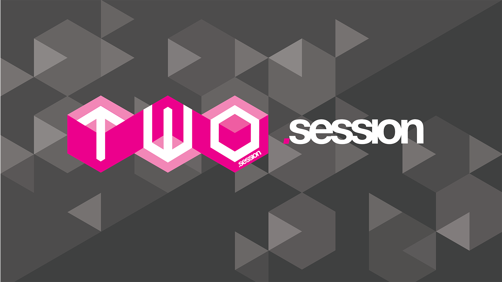
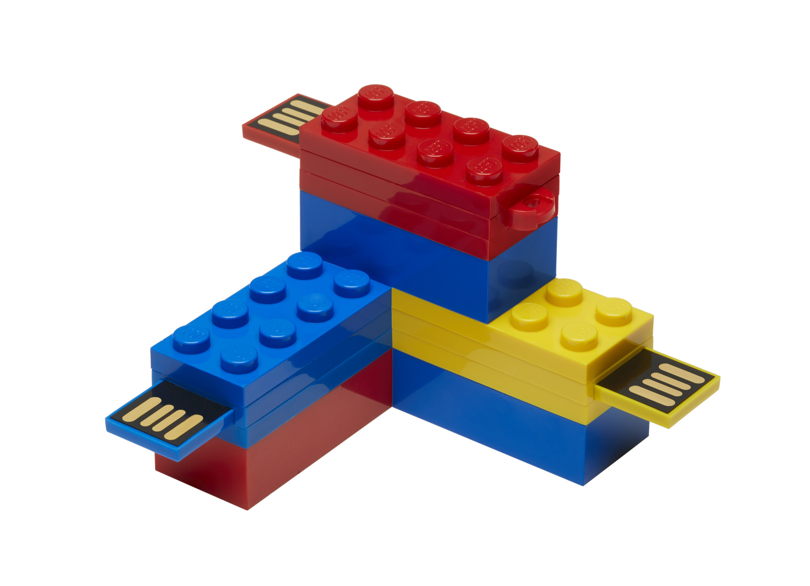
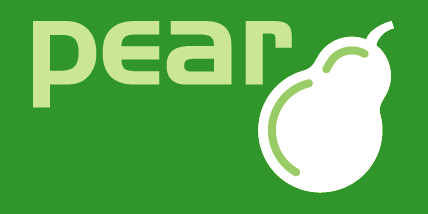
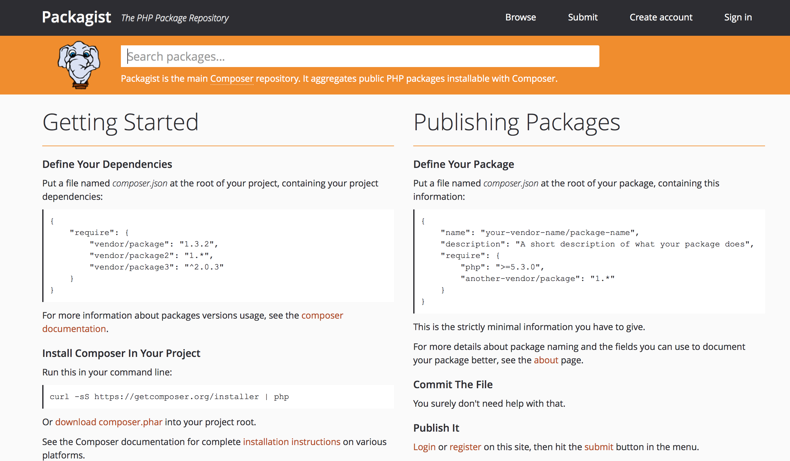
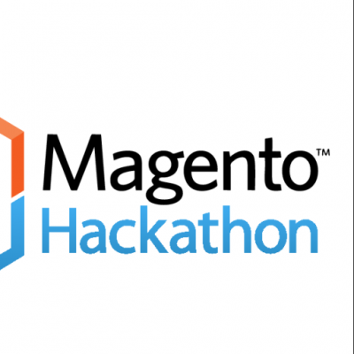
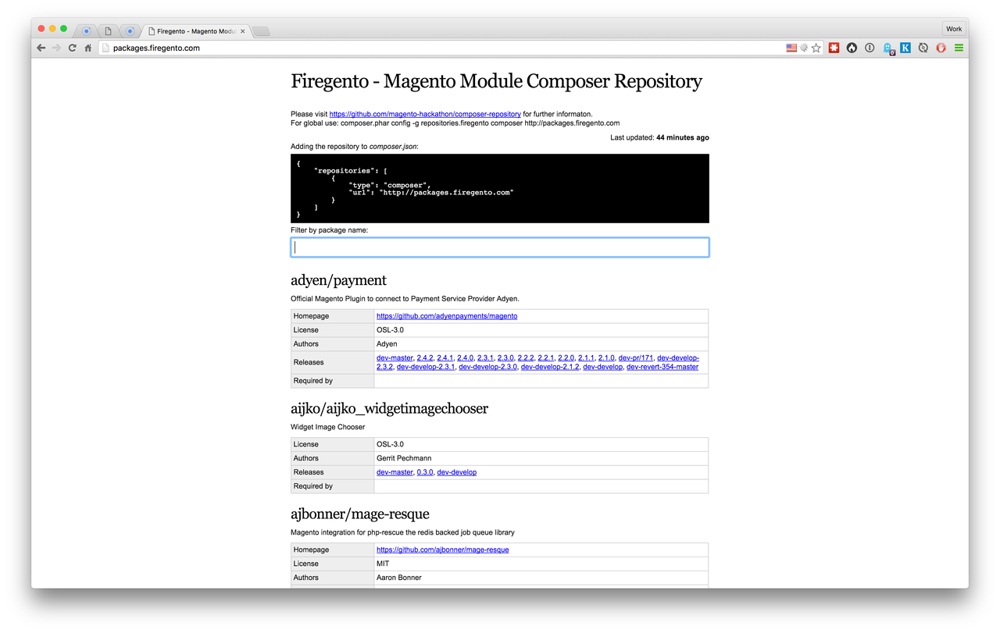
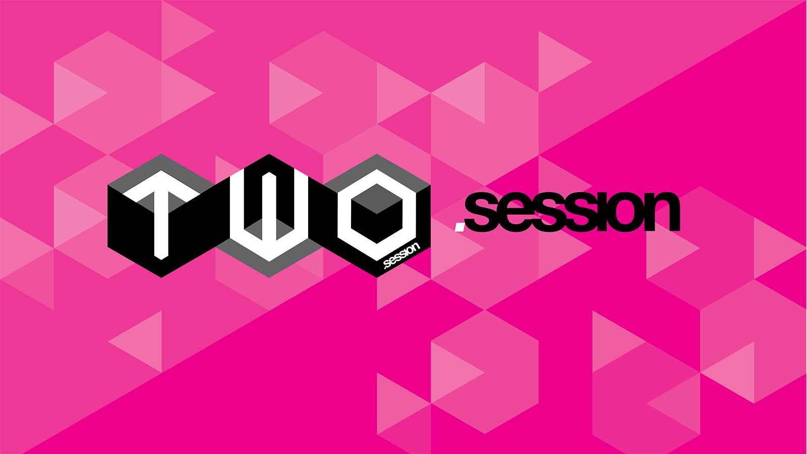

---

## [fit] The _**HOW**_
## [fit] & _**WHY**_
## of composable Magento

---

### James Cowie
### Technical Team Lead Session Digital
#### t/**@jcowie** gh/**jcowie**

### Alistair Stead
### CTO Session Digital
#### t/**@alistairstead** gh/**alistairstead**

---

# [fit] Reuse...

**verb** |riːˈjuːz| _[ with obj. ]_
use again or more than once: the tape could be magnetically erased and reused.

**noun** |riːˈjuːs| _[ mass noun ]_
the action of using something again: the ballast was cleaned ready for reuse.

^ What is reuse? Programmers are taught this from day one. This is a watchword for everything that drives our industry. Write code so it can be re-used re-purposed. This is why we have modular patterns, inheritance, extension points. This drives the idea of don't repeat yourself. In fact I have been heard to state many times both in public to any audience that would listen to me, and privately that I would rather hire a lazy engineer than one prepared to merrily keep typing and building the same features over and over and over...

^ Is reuse a myth? A fallacy driven from misunderstanding or the principles by which DRY was defined? A big industry misunderstanding?

---

# **D**on't **R**epeat **Y**ourself[^⌘]

[^⌘]: Cut: Command ⌘ - x, Copy: Command ⌘ - c, Paste: Command ⌘ - v

^ DRY is not about simplistic code duplication. It is about duplication of knowledge and intent.

---

> “Every piece of knowledge should have one and only one representation.”
-- Dave Thomas and Andy Hunt

^ This is the most subtle of principles. We tend to think of duplication at a code level — a mechanical “this looks like that, so duplication!” level. However, this guiding principle isn’t about code duplication; it is about knowledge duplication.

^ A lot of people are introduced to this idea through the DRY principle, or Don’t Repeat Yourself. This was established in the book, The Pragmatic Programmer, by Dave Thomas and Andy Hunt.

^ The DRY principle states “Every piece of knowledge should have one and only one representation.” This rule also has been expressed as “Once and Only Once.” http://pragprog.com/book/tpp/the-pragmatic-programmer

^ Instead of looking for code duplication, always ask yourself whether or not the duplication you see is an example of core knowledge in the system.

---

# [fit] Inheritance

^ Inheritance, objects and the promised land of reuse...

^ Inheritance gives us reuse... It lets us use fewer key strokes in order to be share behavior between objects. But this type of reuse is lying to you. Inheritance creates tight coupling and eventually limits the scope to which you can reuse your beautifully crafted code.

---

# [fit] Traits *_&_* Mixins?

^ Oh wait, then the language authors and fellow programmers go and provide another way to misrepresent reuse and tempt us into thinking we are following DRY principles. This is closer but can provide a false sense of accomplishment.

---

# [fit] Composition

---

# ⎏
# [fit] Interfaces

---

# [fit] Modules for reuse

^ We have modules for reuse but it is only reuse within the context of Magento and at that only reuse with Magento as of the major version when you wrote the module.

---

# 

^ Magento has always (almost always) been extensible through modular code reuse. The connect marketplace had a higher purpose but it meant that Magento allowed modular code reuse.

^ Though to be honest not many development teams seemed to use it extensively. We all know first had the issues connect had and by design its ease of use for non developers to install from was not ideal. But lets not forget that at least the tought process was in place to allow us to think about how packages created for Magento could be re used in other projects.

---

# 

^ It was based on the PHP library repository technology of the time PEAR but restricted the use to the Magento repository for installs. Using the wider community of PEAR packages was problematic and there was nothing but legacy code in the PEAR channels.

---

# `modman`

^ Thanks to Colin Mollenhour we got modman and we could begin to script and compose our modular application dependencies. However at this time this was a shim to installing just the connect modules packaged with PEAR.

^ Over time Modman allowed us to take individual modules and put them in there own source control system and use modman to link them into a Magento 1 install. For a series of bash scripts this worked really really well and is still in use for many projects today.

---

# [fit] Composer 

^ in 2011 Jordi Boggiano started out on creating a solution for the PHP community. His goal was to have a reliable package manager for PHP so anyone could create packages that could be used in any project. Composer was going to be the tool that managed a projects dependency by pinning versoins of installed software and could over time manage the dependencies of dependencies.

^ One of the problems we as Magento developers faced was that Magento 1 shipped with a non standard or easily extensible autoloader so any opportunity to load or use these packages was not going to be an easy journey.

---
# [fit] Magento - Composer 

^ One of the problems we as Magento developers faced was that Magento 1 shipped with a non standard or easily extensible autoloader so any opportunity to load or use these packages was not going to be an easy journey.

^ Thankfully this bridge was crossed with the hard work of the many developers behind the magento composer hackathon project. Simple in design this project added as a plugin to composer can detect in a composer.json file a new node for module type and treat these modules deifferently to regular composer packages. The different being that it will based on deployment strategy move the files into the correct location. This can be based on json mappings of source to destination or reading modman files.

---

# [fit] packages.firegento 

^ So now we had a means of installing Magento modules other than Connect or Modman but other than using connect to search or github search to find a package we were limited in how we could find this units of work. What we needed was our own packagist that we could search and find the packages that we wanted to install quickly and in a versioned way. What packages does is gives us the ability to install any of the Magento connect free modules, as well as allong any developer to publish there own modules via a simple pull request to the repository that powers this site. For the first time with this and all of the previous tools we were well on track to being able to share, pin versions and use other modules as a dependency on our own project.

---

# [fit] Composable
# Magento

---

# [fit] Service contracts

---

# [fit] Abstraction
# away from the framework

^ If you are using composer and the generated autoloading functionality it is practical to write code that is unaware of Magento, that sits in some other location than a Magento module but is wired into the structures and deep inheritance chain that Magento defines. The wiring however is minimal and isolated away from the code that solve the actual problem. This means you have created a solution prime for re-use because it can be re-wired or re-composed into other projects and applications.

---

# [fit] The naked
# Magento module

^ The idea of the naked module is to create code that is completely unaware that it will be applied within a Magento application. This would mean that it can also be applied to a new version of Magento with a greatly reduced amount of re-work. We get to apply DRY in the true form and only create the new wiring to Magento 2 or 3 or 4. Magento will last for ever you know!

---

> Your **value** as an engineer is not the sum of the code you have written
-- LoC !== $$

^ The value of engineer is their ability to write code to solve problems. However their value is not attached to that code. Deleting code should not be painful and you should not be protective of your code beyond it's ability to solve a problem.

^ A higher value of an engineer is the ability to solve problems using the most appropriate solution available to them which may indeed involve choosing to not write code but instead assess and select an appropriate solution written by someone else.

---

# [fit] Ephemeralisation

---

#
# [fit] Doing more with less[^Fuller, 1938]

[^Fuller, 1938]: Buckminster (Bucky) Fuller

^ The true power of an engineer is doing more with less. Using composable components to deliver functionality should be seen as far superior to re-crafting code to solve a problem already solved by someone else. Not least because they may well know more about the problem than you. If the solution is fit for purpose then of course you should look to alternatives but first check that you are not being vein.

---

## Reuse through reduced MASS

## $$ mass = \frac{n}{m/s^2} $$

^ So what I'm proposing here is not simply a call to achieving more with less effort. It is about being more effective and achieving more reuse by building with less mass. DEMASS! Building code with a clean, clear intent that is focused on doing one thing well and only one thing.

---

# [fit] Building **LESS**, well!

^ Smaller more focused modules and components are more portable and more reusable. This should be a familiar principle. It is the principle upon which unix systems are based and other languages and platforms have got this right also e.g. node.js, python.

^ Building on the physics anecdote then objects with less mass have less inertia and it is much easier to influence their path. Making them much more flexible and usable in unplanned contexts.

---

# [fit] Thank you...

---

---

---

# [We are hiring...]

---

# Credits

* https://skillsmatter.com/skillscasts/6433-business-logic-a-different-perspective
* https://www.youtube.com/watch?v=X8lqnO7aYe0
