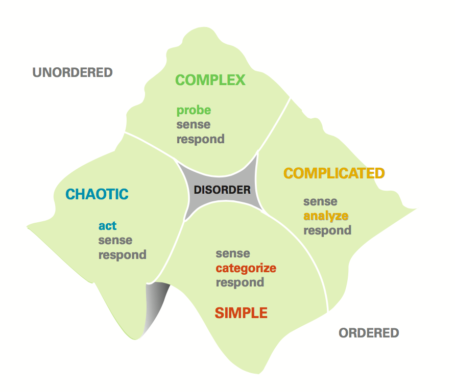

footer: \#BDD
slidenumbers: false

# [fit] __Handling Complexity__

---

# Cynefin
## __Pronounced ku-nev-in__

^ A brief introduction to Cynefin.

---

^ Perspectives: Deliverables, Projects, People Interaction

---

# Simple:

* Input Forms
* Semantic Markup
* Cloudinary Integration (With a module)
* Out of the box Magento
* Working individually

---

# Complicated:

* CRUD
* Facet search
* SAP Integration
* Rebuilding existing website features with Symfony
* Reaching team decisions

---

# Complex:

* Race conditions
* Resolving performance problems
* Browser compatibility
* Building a startup
* Missing requirements
* Negotiating with disagreeing parties

---

# Chaotic:

* System failures
* DDoS
* Startup that make assumptions regarding out of the box Magento
* Inconsolable differences

---

# Disorder:

* Machine for passing arbitrary objects across the table
* Building simple eCommerce from scratch
* Warring parties

---

## Default State

---

### Have we (the team) ever done it before?

1. Entire team => Simple
1. Someone in the team => Simple - Complicated
1. Someone in the organisation => Complicated
1. Someone in the world => Complex
1. Nobody ever => Complex

__(Liz Keogh)__

---

# Where can the framework help?

^ Assuming we know where we are within the framework what do we do.

^ Board - High strategic level
Project - Project strategic level
Team - Tactical approach to prioritisation and sprint planning
Individual - Problem solving

^ The goal is to find ways to shift the problem clockwise

---

# __*Individuals:*__
## Solving the right problem

^ What problem space are you working in and is there a ready made solution.

^ Is this problem the key to the business? Is this the clients USP?

^ Commodity or differentiator

^ Decide when good is good enough….

^ Algorithmic performance Vs best fit and heuristics

^ Pixel perfection Vs facsimile

---

# __*Individuals:*__
## Finding the right path

^ Expanding upon empirical approaches to problem solving

^ Being in disorder and not seeing path through domains

^ Example: Magento cache

---

# __*Teams:*__
## When being excellent is bad

^ Deciding to not invest in analysis, planning and design of commodities

^ Don’t invest too much time discussing magento standard features. Don’t validate standard behaviour rather focus on other more important unique features.

^ When a client's USP is their product or price they don’t get value from an amazing shopping experience or technical elegance. They get value from going to market early and capitalising on that advantage.

^ If it brings value later then you can improve the other factors.

---

# __*Teams:*__
## When being good is not enough

^ Making sure that commodities is not the only set of project deliverables.

^ Focus on the clients USP and invest your best people and effort in that.

---

# __*Projects:*__
## Asking the right questions

^ During discovery you can use the framework to quickly classify conversation and requirements and keep asking questions to break down the conversation towards simple and obvious

^ Identify in which areas to spend more time discussing and which areas are fine being “out of the box”

^ Identify the natural domain client defaults to, act accordingly

---

# __*Projects:*__
## Planning the right product

^ Is this a commodity feature that supports the real world differentiators or is it supposed to be differentiator on its own?
What’s the balance between differentiators and commodities should we have in the backlog?

---

# __*Sales:*__
## Choosing an appropriate methodology

^ Identify R&D projects that do not need the same investment in quality, but need budgeting, not scoping model… You need to use all the effort possible to probe and explore to identify the problem space and opportunities.

^ Identify repeatable projects where quality is important and integral to successful delivery.

^ Complex -> R&D -> LEAN, No scope, 1000s of options, set budget, very limited amount of time, low quality => LEARN advantage
Complicated -> Agile(Scrum/Kanban) -> Flexible scope, Concrete options, Set budget, high quality => EARN advantage
Obvious -> Waterfall, Best-practices, Constraints and visibility -> Fixed scope, No options, Set budget, average quality => EARN commodity

---

# __*Sales:*__
## Supporting client decisions

^ Help clients classify their problems and identify the smaller steps to create more manageable and sustainable project.

^ Manage scope.
Manage risk.
Identify priorities.

^ An end to MoSCoW documents by helping clients identify market advantage and prevent them focusing on commodity that is prevalent in RFP / RFI engagements.

---

# __*You:*__
## Where else could this be useful?

^ I personally am finding this helpful when in complex situations where there may be conflict or disagreement. If I can identify the context or the bias of the various parties it can be very helpful in building empathy.

---

## Thank you!
# __*Questions?*__

